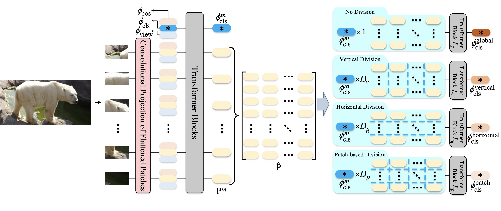
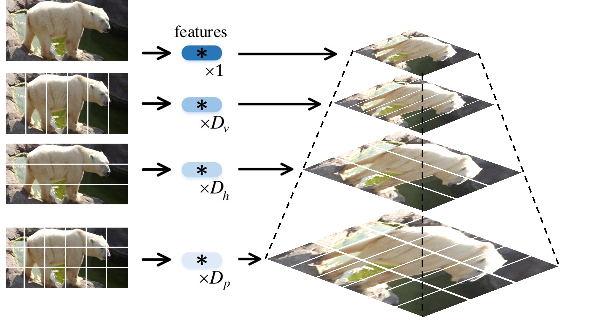
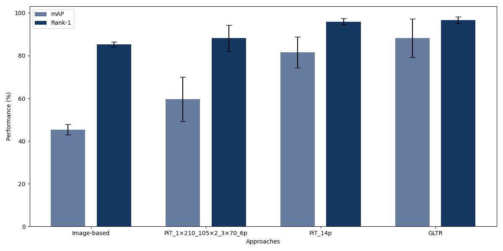
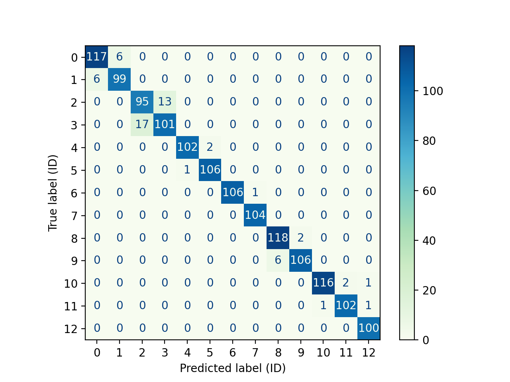
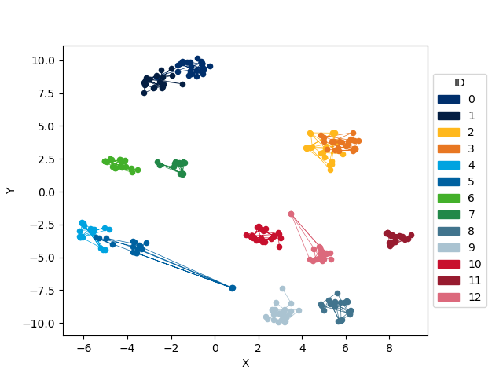

# Multi-direction and Multi-scale Pyramid in Transformer for Video-based Pedestrian Retrieval on PolarbearVidID
   
[](https://paperswithcode.com/sota/person-re-identification-on-ilids-vid?p=multi-direction-and-multi-scale-pyramid-in-1) [](https://paperswithcode.com/sota/person-re-identification-on-mars?p=multi-direction-and-multi-scale-pyramid-in-1)

Implementation of the proposed PiT used on the PolarBearVidID Dataset. Please refer to [[PolarBearVidID @ MDPI]](https://www.mdpi.com/2076-2615/13/5/801) and [[PiT @ Arxiv]](https://arxiv.org/pdf/2202.06014.pdf).





## Getting Started
### Requirements

Here is a brief instruction for installing the experimental environment.
```
# Windows 10 and 11 (use cmd)
# install conda (add to path)
$ conda create -n PiT python=3.6 -y
$ conda activate PiT (Win 11: activate PiT)
# install pytorch 1.8.1/1.6.0 (other versions may also work)
$ pip install torch==1.8.1+cu111 torchvision==0.9.1+cu111 torchaudio==0.8.1 -f https://download.pytorch.org/whl/torch_stable.html
$ pip install timm scipy einops yacs opencv-python==4.3.0.36 tensorboard pandas
```

### Download pre-trained model

The pre-trained vit model can be downloaded in this [link](https://github.com/rwightman/pytorch-image-models/releases/download/v0.1-vitjx/jx_vit_base_p16_224-80ecf9dd.pth) and should be put in the `checkpoints/` directory.

### Dataset Preparation

Download PolarBearVidID Dataset at [PolarBearVidID](https://zenodo.org/record/7564529) and store it in the `data/PolarBearVidID` Directory.

## Training and Testing

```
# This command below includes the training and testing processes.
$ python train.py --config_file configs/PolarBearVidID/pit.yml MODEL.DEVICE_ID "('0')"
```

## Visualize findings

```
$ tensorboard --logdir_spec fold1:logs\PolarBearVidID_PiT\1,fold2:logs\PolarBearVidID_PiT\2,fold3:logs\PolarBearVidID_PiT\3,fold4:logs\PolarBearVidID_PiT\4,fold5:logs\PolarBearVidID_PiT\5
```

## Create attention map

```
$ python vis.py --config_file configs/PolarBearVidID/pit.yml MODEL.DEVICE_ID "('0')"
```


## Results on PolarBearVidID
With a rank-1 performance of 95.88 ± 1.45 % and a mAP score of 81.62 ± 7.23 %, the adapted PiT_14p trained for 400 epochs
outperformed the image-based baseline approach while almost reaching the performance
of GLTR.





## Acknowledgement

This repository is built upon the repository [PiT](https://github.com/deropty/PiT) and [TranReID](https://github.com/damo-cv/TransReID).

## Citation

If you find this project useful for your research, please kindly cite:
```
@article{zuerl_polarbearvidid_2023,
	title = {{PolarBearVidID}: {A} {Video}-{Based} {Re}-{Identification} {Benchmark} {Dataset} for {Polar} {Bears}},
	volume = {13},
	issn = {2076-2615},
	shorttitle = {{PolarBearVidID}},
	url = {https://www.mdpi.com/2076-2615/13/5/801},
	doi = {10.3390/ani13050801},
	language = {en},
	number = {5},
	urldate = {2023-02-27},
	journal = {Animals},
	author = {Zuerl, Matthias and Dirauf, Richard and Koeferl, Franz and Steinlein, Nils and Sueskind, Jonas and Zanca, Dario and Brehm, Ingrid and Fersen, Lorenzo von and Eskofier, Bjoern},
	month = feb,
	year = {2023},
	pages = {801}
}
```
And the original authors of PiT

```
@ARTICLE{9714137,
  author={Zang, Xianghao and Li, Ge and Gao, Wei},
  journal={IEEE Transactions on Industrial Informatics}, 
  title={Multidirection and Multiscale Pyramid in Transformer for Video-Based Pedestrian Retrieval}, 
  year={2022},
  volume={18},
  number={12},
  pages={8776-8785},
  doi={10.1109/TII.2022.3151766}
}
```

## License
This repository is released under the GPL-2.0 License as found in the [LICENSE](LICENSE) file.
